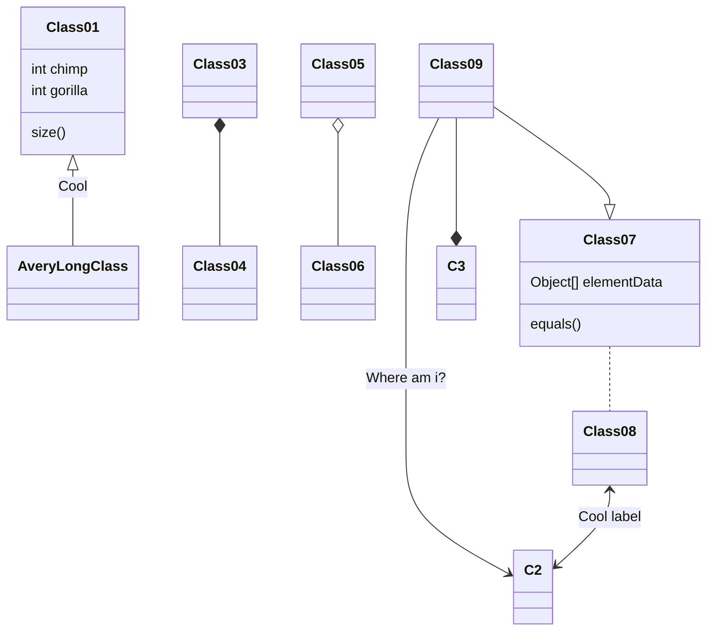

## AQUAI

Copyright to Kitekii 2022.

### Creating FSM in ECS mode

### Refers

[flecs::type](https://ajmmertens.medium.com/why-storing-state-machines-in-ecs-is-a-bad-idea-742de7a18e59)

[entt-dev/FSM](https://github.com/entt-dev/FSM.git)

